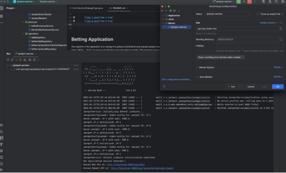
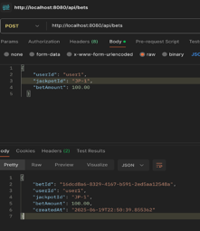
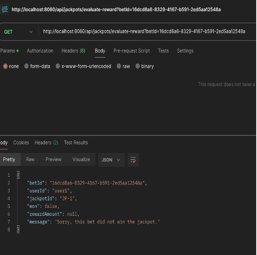
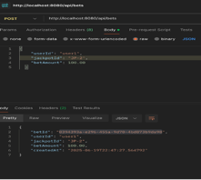
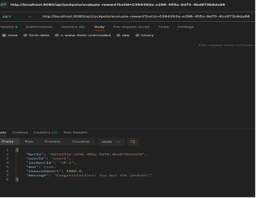
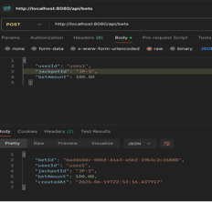
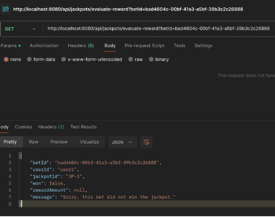
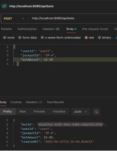
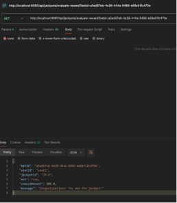

# Betting Application

The objective of the application is to manage the jackpot contributions and evaluate jackpot rewards, developed as per the requirements.
The entire system flow, from API to service to repository, leverages reactive types (`Mono`, `Flux`) to ensure non-blocking execution where possible. 
This improves resource utilization and system throughput, especially under high concurrency.


## Overview

The service provides two main functionalities:

1.  **Jackpot Pool Contribution:** When a bet is placed, a configured percentage of the bet amount contributes to a matching jackpot pool.

2.  **Jackpot Reward Evaluation:** An API endpoint to check if a contributing bet wins a jackpot reward. If a reward is won, the jackpot pool is reset to its initial value.

### Key Features Implemented:

* **API Endpoints (Spring WebFlux):**

    * `POST /api/bets`: Publishes a new bet asynchronously.

    * `POST /api/jackpots/evaluate-reward`: Evaluates if a given bet wins a jackpot reward reactively and returns the outcome.

* **Kafka Integration (Mocked):**

    * A mocked Kafka producer service (`MockKafkaProducerService`) returns `Mono<Void>` to simulate a non-blocking publish operation. It logs the bet payload.
  
      `NOTE : It also invokes a KafkaConsumerService#consumeBet for the sake of completeness.`

    * A mocked Kafka consumer service (`KafkaConsumerService`)  consume bets and triggers their asynchronous processing via reactive service calls.

* **In-Memory Database:** Uses `ConcurrentHashMap` for storing `Bet`, `Jackpot`, `JackpotContribution`, and `JackpotReward` entities.

* **Service Layer:** `BetService` and `JackpotService` for asynchronous and non-blocking data flow.

* **Configurable Contribution Strategies:**

    * **Fixed Contribution:** A fixed percentage of the Bet Amount.

    * **Variable Contribution:** Percentage starts bigger and decreases at a fixed rate as the jackpot pool increases.

* **Configurable Reward Strategies:**

    * **Fixed Chance:** A fixed percentage chance for a reward.

    * **Variable Chance:** Chance starts smaller and over time becomes bigger as the jackpot pool increases, reaching 100% if the jackpot pool hits a defined limit.

* **ApplicationRunner:** `JackpotInitializer` for initializing mocked jackpot data objects into the system during application startup.
    
## Technologies Used

* **Java 24 (LTS)**

* **Spring Boot 3.5.0**

* **Maven** (for dependency management and build automation)

* **Lombok** (to reduce boilerplate code for POJOs) [ TODO ]

* **Jackson** (for JSON serialization/deserialization)

* **JUnit 5 & Mockito** (for testing) [ TODO ]

## How to Run the Application

1.  **Prerequisites:**

    * Java Development Kit (JDK) 24 or newer installed.

    * Maven installed.

2. **Build the Project:**

    ```
    mvn clean install
    ```

    This command will compile the code, run tests, and package the application into a JAR file in the `target` directory.

3. **Run the Application:**
    You can run the Spring Boot application using the Maven Spring Boot plugin:

    ```
    mvn spring-boot:run
    ```

    Alternatively, you can run the generated JAR file:

    ```
    java -jar target/jackpot-service-0.0.1-SNAPSHOT.jar
    ```

    The application will start on `http://localhost:8080`

## How to Use the API

API tools like cURL, Postman to interact with the API endpoints.

### 1. Publish a Bet (POST `/api/bets`)

This endpoint simulates publishing a bet. The `MockKafkaProducerService` will log the bet, and the `BetService` will save it to the in-memory repository. The `KafkaConsumerService` will then pick it up and process it (contribute to jackpot, evaluate reward).

* **URL:** `http://localhost:8080/api/bets`

* **Method:** `POST`

* **Headers:** `Content-Type: application/json`

* **Body (JSON):**

    ```json
    {
      "userId": "user123",
      "jackpotId": "JP-1",
      "betAmount": 50.00
    }
    ```

    * You can also try with `jackpotId: "JP-3"` to test the variable strategies.

* **Example cURL Command:**

    ```bash
    curl -X POST \
      http://localhost:8080/api/bets \
      -H 'Content-Type: application/json' \
      -d '{
        "userId": "user123",
        "jackpotId": "JP-1",
        "betAmount": 50.00
      }'
    ```

### 2. Evaluate Bet for Jackpot Reward (GET `/api/jackpots/evaluate-reward?betId="<replace-with-actual-bet-id>"`)

This endpoint checks if a specific bet wins a jackpot reward based on the jackpot's configured reward strategy. If the bet wins, the jackpot is reset.

* **URL:** `http://localhost:8080/api/jackpots/evaluate-reward?betId="<replace-with-actual-bet-id>"`

* **Method:** `GET`

* **Headers:** `Content-Type: application/json`

* **Body (JSON):**

    * **Important:** The `betId` in this request should ideally correspond to a bet that was previously published via `/api/bets`. You can find `betId` from the console output after publishing a bet or from the `JackpotService` logs where bets are processed by the consumer.

    * Use `JP-1` for Fixed Chance or `JP-3` for Variable Chance.

* **Example cURL Command:**

    ```bash
    curl -X GET \
      http://localhost:8080/api/jackpots/evaluate-reward?betId="<replace-with-actual-bet-id>" \
      -H 'Content-Type: application/json'
    ```


## Trade-offs/ TODOs

1.  **In-Memory DTO Repositories:**

    * The usage of `ConcurrentHashMap` operations themselves are blocking.
    * Real Database Integration:** Replace the `InMem*Repository` implementations with actual R2DBC-based repositories for a relational database (e.g., PostgreSQL) for true non-blocking persistence. 
     

2.  **Lombok Extension:**

    * Due to incompatibility issues with local jdk version, Lombok ( used to reduce boilerplate code for POJOs) hasn't been used. Due to this, usage of `Builder` pattern and `@Data` annotations are being skipped. 

3.  **Structured Logging:**

    * Enhance logging using slf4j for debugging complex asynchronous flows.

4.  **Unit Tests (`*ServiceTest.java`):** 

5.  **Integration Tests (`*ControllerTest.java`):**

## Evidence

**Application**
        


**JP-1**




**JP-2**




**JP-3**
    



**JP-4**





